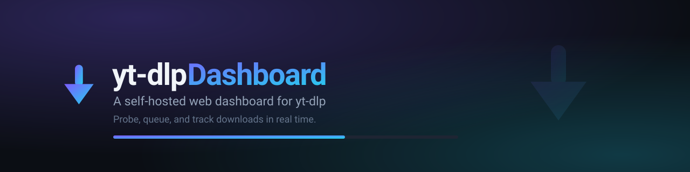
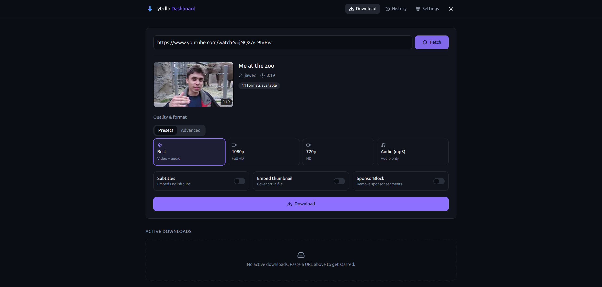
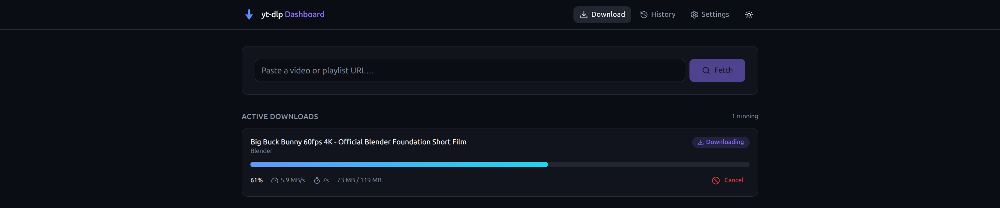
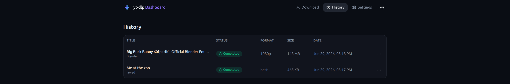
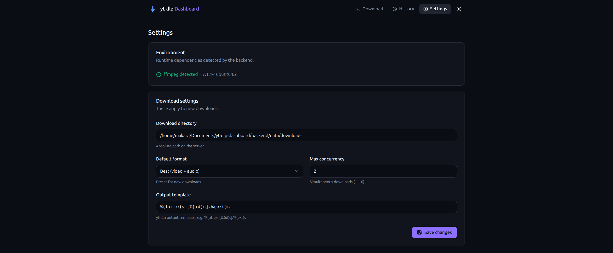

<div align="center">



<h1>yt-dlp Dashboard</h1>

<p><strong>A self-hosted web dashboard for <a href="https://github.com/yt-dlp/yt-dlp">yt-dlp</a> — probe, queue, and track downloads in real time.</strong></p>

<p>
  
  
  
  
  
  
</p>

</div>

---

**yt-dlp Dashboard** wraps the powerful [yt-dlp](https://github.com/yt-dlp/yt-dlp) downloader in a clean, modern web UI. It's built for self-hosters and home-lab users who want a single-user, no-login interface to fetch video metadata, pick a quality preset or an exact format, and watch downloads progress live — with a persistent history that survives restarts. The backend embeds yt-dlp as a Python library (no shelling out), runs downloads through a concurrent async job queue, and streams progress to the browser over WebSockets.

## Preview

| Submit &amp; probe | Active downloads | History |
| :---: | :---: | :---: |
|  |  |  |

<div align="center"><sub>Real screenshots of the running app. Settings page below.</sub></div>

## Table of Contents

- [Features](#features)
- [Tech Stack](#tech-stack)
- [Quick Start (Docker)](#quick-start-docker)
- [Prerequisites](#prerequisites)
- [Manual Installation](#manual-installation)
- [Configuration](#configuration)
- [Usage](#usage)
- [API Reference](#api-reference)
- [Troubleshooting &amp; FAQ](#troubleshooting--faq)
- [Responsible Use](#responsible-use)
- [Contributing](#contributing)
- [License](#license)
- [Acknowledgements](#acknowledgements)

## Features

**Downloading**
- Concurrent downloads via an async job queue with a configurable worker pool.
- Job states tracked end to end: `queued → downloading → post-processing → completed` (plus `error` and `cancelled`).
- Cancel in-flight or queued downloads; jobs persist to SQLite and **survive restarts** (interrupted jobs are re-queued).

**Formats &amp; quality**
- One-click presets: **Best (video + audio)**, **1080p**, **720p**, **Audio only (mp3)**.
- **Format ID** mode: pick an exact `format_id` from the probed list; video-only formats are automatically merged with the best audio track.
- **Selector** mode: enter any raw yt-dlp [format selector](https://github.com/yt-dlp/yt-dlp#format-selection) (e.g. `bv*[height<=1080][fps>=60]+ba/b`, codec/HDR/bitrate/extension filters) — passed through verbatim, with quick-insert example chips.

**Metadata &amp; playlists**
- `/probe` extracts title, uploader, duration, thumbnail and the full format list **without downloading**.
- Playlist URLs are detected and reported (item count) so you know what you're pointing at.
- **Playlist downloads:** grab the whole playlist, a range/selection (`1-10,15,20:30`), reverse or random order, skip unavailable entries, stream lazily, and ignore duplicates via a download archive. Configure via **Advanced options → Playlist**. (A playlist runs as a single job producing multiple files on disk.)

**Subtitles, thumbnails &amp; SponsorBlock**
- Toggle subtitle embedding, thumbnail embedding, and SponsorBlock sponsor-segment removal per download.
- **Subtitles (advanced):** download uploader subtitles and/or auto-generated captions, choose one or more languages (`en, es, en.*`), embed into the video or keep as separate files, and convert to `srt`/`ass`/`vtt`/`lrc`. Configure via the **Advanced options → Subtitles** panel on the download screen.
- **Thumbnails (advanced):** save the thumbnail as a separate file, save every available thumbnail, embed the cover into the media file, and convert to `jpg`/`png`/`webp`.
- **Metadata (advanced):** embed metadata (title, uploader, date, description) and chapter markers into the file, write the full `.info.json` sidecar, fetch comments, and preserve the upload date as the file's modified time.

**Audio extraction**
- Extract audio-only downloads to `mp3`, `aac`, `opus`, `flac`, `wav`, `vorbis` or `m4a`, set the quality (VBR `0`–`10` or a kbps value), keep the original codec (copy), normalize loudness (ffmpeg `loudnorm`), and pass custom ffmpeg arguments. Configure via **Advanced options → Audio**.

**Download control**
- Per-download speed limit (`2M`/`500K`), retry count, fragment retries, retry delay, concurrent fragment downloads, resume toggle, download sections/timestamps (`*10:00-15:00` or a chapter regex), and max/min file-size filters. Configure via **Advanced options → Download control**.

**Network**
- HTTP/SOCKS proxy, custom User-Agent, Referer, arbitrary request headers, geo-bypass (with optional country), IPv4/IPv6 forcing, and local bind address. Configure via **Advanced options → Network**.

**Real-time progress**
- Live per-job progress over WebSocket: percent, speed, ETA and byte counts, with a smooth gradient progress bar.

**History &amp; files**
- Sortable history table with status badges, format, file size and date.
- Per-row actions: download the finished file, re-download with the same options, or delete (optionally removing the file from disk).

**Settings**
- Configure download directory, default format, max concurrency, and the yt-dlp output template from the UI.
- ffmpeg is detected at startup; the UI shows a clear warning if it's missing.

**Polish**
- Responsive layout, dark mode (default) and light mode, built with [shadcn/ui](https://ui.shadcn.com)-style components.

## Tech Stack

| Layer | Technology |
| --- | --- |
| Backend | Python 3.11, [FastAPI](https://fastapi.tiangolo.com), [uvicorn](https://www.uvicorn.org) |
| Downloader | [yt-dlp](https://github.com/yt-dlp/yt-dlp) embedded as a library |
| Persistence | SQLite via [SQLModel](https://sqlmodel.tiangolo.com) |
| Queue | `asyncio.Queue` + worker pool, blocking calls in a thread executor |
| Real-time | WebSockets (per-job pub/sub broker) |
| Frontend | [React 19](https://react.dev), [Vite](https://vitejs.dev), TypeScript, [Tailwind CSS](https://tailwindcss.com), shadcn/ui, [TanStack Query](https://tanstack.com/query) |
| Tooling | [uv](https://docs.astral.sh/uv/) (Python), [pnpm](https://pnpm.io) (frontend) |
| Media | [ffmpeg](https://ffmpeg.org) for merging, audio extraction, embedding |

## Quick Start (Docker)

The fastest path to a running app. Requires Docker with the Compose plugin — **ffmpeg is bundled in the image**, so this is the only dependency you need on the host.

```bash
git clone https://github.com/your-username/yt-dlp-dashboard.git
cd yt-dlp-dashboard
docker compose up --build
```

Then open **http://localhost:8000**.

Downloaded files appear in `./downloads` and the SQLite database (history + settings) is persisted in `./data` on the host — both are mounted as volumes, so your data and files survive container restarts and rebuilds.

> The Docker image is a single container: it builds the frontend, then FastAPI serves the static bundle **and** the API on port `8000`.

## Prerequisites

For **Docker**, you only need Docker. For a **manual install**, you need:

- **Python 3.11+** and **[uv](https://docs.astral.sh/uv/)**
- **Node.js 20+** and **[pnpm](https://pnpm.io)**
- **ffmpeg** on your `PATH`

Install ffmpeg:

```bash
# macOS (Homebrew)
brew install ffmpeg

# Debian / Ubuntu
sudo apt update && sudo apt install -y ffmpeg

# Windows (winget)
winget install Gyan.FFmpeg
# …or Chocolatey
choco install ffmpeg
```

Install uv and pnpm if you don't have them:

```bash
# uv (macOS/Linux)
curl -LsSf https://astral.sh/uv/install.sh | sh

# pnpm (via corepack, ships with Node)
corepack enable && corepack prepare pnpm@latest --activate
```

## Manual Installation

Run the backend and frontend as two dev processes. See [docs/SETUP.md](docs/SETUP.md) for the full guide (production, reverse proxy, systemd).

### Backend

```bash
cd backend
uv sync                                   # create venv + install deps (pulls Python 3.11 if needed)
uv run uvicorn app.main:app --reload --port 8000
```

The API is now on **http://localhost:8000** (interactive docs at `/docs`).

### Frontend

In a second terminal:

```bash
cd frontend
pnpm install
pnpm dev
```

Open **http://localhost:5173**. The Vite dev server proxies `/api` and `/ws` to the backend on port 8000, so both work together with no extra config.

## Configuration

Most settings are editable live from the **Settings** page (persisted in SQLite). Bootstrap values — used on first run and to locate data — are set via environment variables on the backend.

### Runtime settings (Settings page → `PUT /api/settings`)

| Setting | Description | Default |
| --- | --- | --- |
| Download directory | Absolute path on the server where files are saved | `backend/data/downloads` (dev) · `/downloads` (Docker) |
| Default format | Preset applied to new downloads: `best` / `1080p` / `720p` / `audio` | `best` |
| Max concurrency | Simultaneous downloads (1–16); the worker pool resizes live | `2` |
| Output template | yt-dlp output template | `%(title)s [%(id)s].%(ext)s` |

### Environment variables (backend)

| Variable | Description | Default |
| --- | --- | --- |
| `YTDLP_DOWNLOAD_DIR` | Initial download directory (seeds the setting on first run) | `backend/data/downloads` |
| `YTDLP_DATABASE_URL` | SQLite URL for the job/settings database | `sqlite:///backend/data/app.db` |
| `YTDLP_STATIC_DIR` | Directory of a built frontend to serve at `/` (set automatically in Docker) | _empty_ (dev uses Vite) |
| `YTDLP_CORS_ORIGINS` | Allowed CORS origins (JSON list) for the dev server | `["http://localhost:5173", "http://127.0.0.1:5173"]` |

The HTTP **port** is controlled by uvicorn (`--port 8000`) or the published Docker port (`8000:8000`). To change the dev backend target for the Vite proxy, set `VITE_BACKEND` before `pnpm dev`.

## Usage

1. **Paste a URL and fetch.** Enter any yt-dlp–supported video or playlist URL and click **Fetch**. The app probes it and shows a metadata card (thumbnail, title, uploader, duration) without downloading anything.

   

2. **Choose quality and options.** Pick a preset (Best / 1080p / 720p / Audio mp3) or switch to **Advanced** to select an exact format. Toggle subtitles, thumbnail embedding, or SponsorBlock, then click **Download**.

3. **Watch it live.** The job appears under **Active downloads** with a live progress bar, speed and ETA, streamed over WebSocket. Cancel any time.

   

4. **Manage your library.** Completed downloads land in **History**, where you can download the file, re-download with the same options, or delete it.

   

## API Reference

All endpoints are under `/api`; interactive OpenAPI docs are at `/docs`.

| Method | Path | Description |
| --- | --- | --- |
| `POST` | `/api/probe` | Extract metadata + formats without downloading |
| `POST` | `/api/downloads` | Enqueue a download; returns a job id |
| `GET` | `/api/downloads` | List jobs (paginated) |
| `GET` | `/api/downloads/{id}` | Get a single job |
| `POST` | `/api/downloads/{id}/cancel` | Cancel a queued or running job |
| `DELETE` | `/api/downloads/{id}` | Remove from history (optionally delete the file) |
| `GET` | `/api/settings` · `PUT` | Read / update settings |
| `GET` | `/api/files/{id}` | Download the finished file |
| `GET` | `/api/health` | Health + ffmpeg detection |
| `WS` | `/ws/downloads/{id}` | Live progress stream for one job |

## Troubleshooting &amp; FAQ

<details>
<summary><strong>"ffmpeg not found" warning</strong></summary>

The backend logs a warning at startup and the Settings page shows it. Merging separate video/audio streams, audio extraction (mp3), thumbnail embedding and SponsorBlock all require ffmpeg. Install it (see [Prerequisites](#prerequisites)) and restart the backend. The Docker image already includes ffmpeg.
</details>

<details>
<summary><strong>Port 8000 (or 5173) already in use</strong></summary>

Start the backend on another port: `uv run uvicorn app.main:app --port 8080`. For Docker, change the published port in `docker-compose.yml` (e.g. `"8080:8000"`). For the Vite dev server: `pnpm dev --port 5174`.
</details>

<details>
<summary><strong>A probe or download fails for a specific URL</strong></summary>

Probe and download errors are surfaced as readable messages in the UI (not 500s). The most common cause is an out-of-date yt-dlp — sites change frequently. See "How do I update yt-dlp?" below. Some URLs require cookies/auth, which this single-user dashboard does not currently manage.
</details>

<details>
<summary><strong>Permission errors writing to the download directory</strong></summary>

Ensure the directory exists and is writable by the process (or by the container user for Docker). With Docker, the host `./downloads` folder is bind-mounted to `/downloads`; make sure your user can write to it.
</details>

<details>
<summary><strong>How do I update yt-dlp?</strong></summary>

- **Manual:** `cd backend && uv lock --upgrade-package yt-dlp && uv sync`
- **Docker:** rebuild the image: `docker compose build --no-cache && docker compose up -d`
</details>

See [docs/SETUP.md](docs/SETUP.md) for backups, resetting the database, reverse-proxy and systemd setup.

## Responsible Use

This project is a convenience UI around yt-dlp. **You are responsible for how you use it.** Respect each website's Terms of Service and applicable copyright law, and only download content you have the right to download. Do not use this tool to infringe copyright or violate any site's terms.

## Contributing

Contributions are welcome! If a `CONTRIBUTING.md` is present, start there. In short:

1. Fork and create a feature branch.
2. Backend dev: `cd backend && uv sync && uv run uvicorn app.main:app --reload`.
3. Frontend dev: `cd frontend && pnpm install && pnpm dev`.
4. Keep the API contract (`backend/app/schemas.py`) and the typed client (`frontend/src/lib/types.ts`) in sync.
5. Open a PR with a clear description.

See [CONTRIBUTING.md](CONTRIBUTING.md) for details.

## License

Released under the [MIT License](LICENSE).

## Acknowledgements

- [**yt-dlp**](https://github.com/yt-dlp/yt-dlp) — the feature-rich downloader that powers every download here. This project is an independent UI and is not affiliated with or endorsed by the yt-dlp project.
- [**ffmpeg**](https://ffmpeg.org) — for muxing, audio extraction and post-processing.
- [FastAPI](https://fastapi.tiangolo.com), [React](https://react.dev), [Tailwind CSS](https://tailwindcss.com) and [shadcn/ui](https://ui.shadcn.com) for the foundations.
